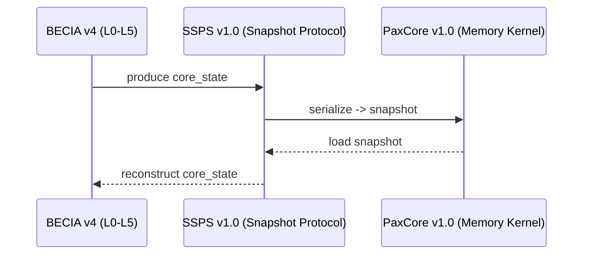

# BECIA v4 — Intelligence Architecture Ecosystem
### SSPS Session State Persistence System Protocol • PaxCore Memory Kernel
---

## Welcome

This site contains the public specifications for the **BECIA v4 Intelligence
Architecture**, the **SSPS Session State Persistence System Protocol**, and the **PaxCore Memory
Kernel**.

Together, these components define a minimal, deterministic, privacy‑aligned
continuity layer for LLM‑based agents.

The ecosystem is:

- **model‑agnostic**  
- **runtime‑agnostic**  
- **interoperable**  
- **designed for long‑term stability**  

---

## The Architecture at a Glance
Below is a high‑level view of how the components interact:

### Diagram

This pipeline ensures **continuity** across sessions without storing raw logs,
transcripts, or sensitive content.

---

## Quick Start

Even without implementation code, the workflow is simple:

1. **BECIA** processes user input through layers L0–L5  
2. BECIA produces a **core_state**  
3. **SSPS** serializes core_state into a **snapshot**  
4. **PaxCore** stores the snapshot  
5. On the next session, PaxCore loads the snapshot  
6. SSPS reconstructs core_state  
7. BECIA resumes with continuity  

Full details are available in the specifications below.

---

## Specifications

### Core Documents

- **BECIA v4 Architecture**  
  👉 [`becia_architecture.md`](becia_architecture.md)

- **SSPS v1.0 Protocol Specification**  
  👉 [`ssps_protocol.md`](ssps_protocol.md)

- **PaxCore v1.0 Memory Kernel Specification**  
  👉 [`paxcore_spec.md`](paxcore_spec.md)

- **Snapshot Profile (BECIA v4)**  
  👉 [`snapshot_profile_becia_v4.md`](snapshot_profile_becia_v4.md)

---

## Roadmap

The full roadmap, including milestone dependencies, metrics, and a visual
timeline, is available here:

👉 [`roadmap.md`](roadmap.md)

---

## Glossary

A complete glossary of terms used across the ecosystem:

👉 [`glossary.md`](glossary.md)

---

## Contributing

Feedback and contributions are welcome through:

- GitHub Issues  
- GitHub Discussions  
- Pull Requests  

Contribution templates are provided for:

- specification proposals  
- bug reports  
- profile definitions  
- backend adapters  

All contributions must align with the principles of minimalism, determinism,
and privacy.

---

## License

All documents in this repository are:

**© 2026 b.AItherix — All Rights Reserved**

This site contains **public specifications only**.  
No proprietary implementation details are included.

---
## About

BECIA, SSPS, and PaxCore are developed by **M.E. Benderyszyn (b.AItherix)**  
as part of a long‑term effort to define stable, privacy‑aligned,  
interoperable intelligence architectures for LLM‑based systems.

